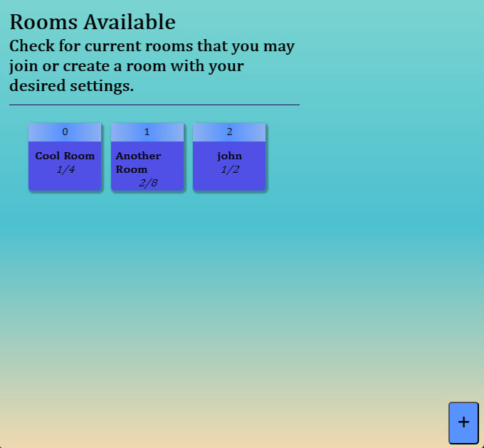

# Servidor Com Salas
Servidor que organiza clientes em salas que conectam uns com os outros, tal que eles podem trocar mensagens entre si.

Esse projeto pessoal é uma iniciativa para combinar a aplicação de Websockets, Typescript e TDD com Jest e Supertest, de forma a auxiliar no aprendizado dessas ferramentas.

